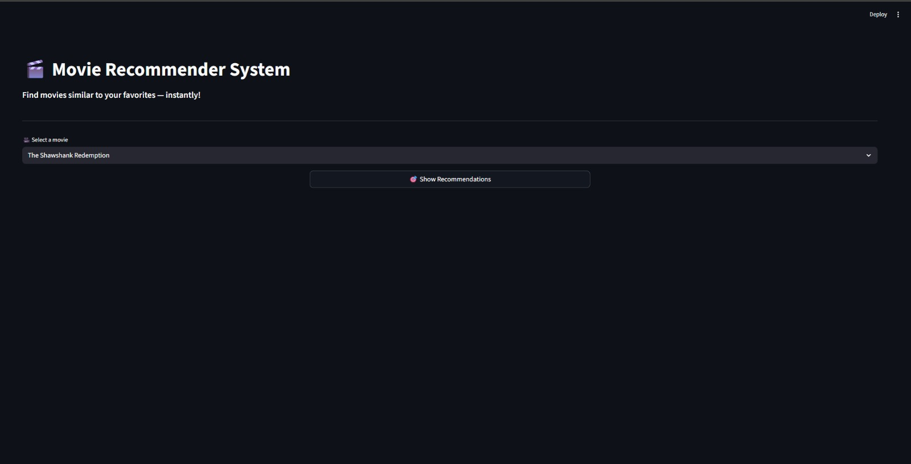
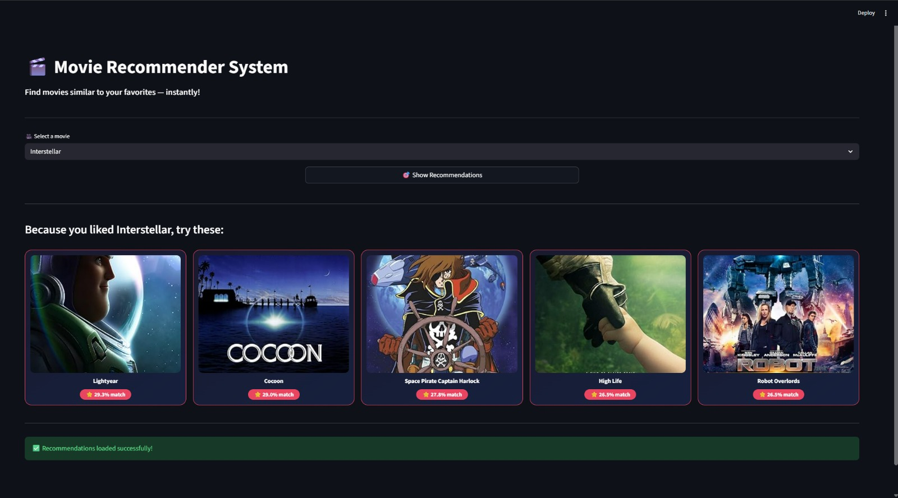

# 🎬 Movie Recommender System

A Machine Learning-based web application that recommends movies similar to the one selected by the user. The system uses **Content-Based Filtering** to analyze movie features and provide personalized movie recommendations through an intuitive web interface.

---

## 🚀 Features

- 🔍 Search movies by title
- 🎯 Get personalized movie recommendations
- 🤖 Content-Based Recommendation System
- 🎬 Displays movie posters
- ⚡ Fast recommendation generation
- 💻 Simple and user-friendly interface

---

## 📸 Application Screenshots

### 🏠 Home Page

<p align="center">

</p>

---

### 🎥 Recommendation Page

<p align="center">

</p>

---

# 🛠️ Tech Stack

## 🛠️ Tech Stack

### Programming Language
- Python

### Framework
- Streamlit

### Machine Learning
- Content-Based Filtering

### Data Processing
- Pandas
- Pickle

### APIs
- OMDb API

### Libraries
- Requests
- Concurrent Futures (`ThreadPoolExecutor`)

### Development Tools
- Jupyter Notebook
- VS Code
- Git
- GitHub

---

# 📂 Project Structure

```text
movie-recommender-system/
│
├── frontend/
│   ├── public/
│   ├── src/
│   ├── package.json
│   └── ...
│
├── images/
│   ├── homepage.jpeg
│   └── recommendations.jpeg
│
├── app.py
├── check.py
├── main.py
├── Main.ipynb
├── dataset.csv
├── movies_list.pkl
├── similarity.pkl
├── README.md
```

---

# ⚙️ Installation

## Clone the Repository

```bash
git clone https://github.com/bhavanikamalekar/movie-recommender-system.git
```

## Navigate to the Project

```bash
cd movie-recommender-system
```

## Install Dependencies

```bash
pip install -r requirements.txt
```

## Run the Application

```bash
python app.py
```

The application will run at:

```
http://127.0.0.1:5000
```

---

## ⚠️ Note

The `similarity.pkl` file is **not included** in this repository because its size exceeds GitHub's file upload limit.

To run the project successfully:

1. Open `Main.ipynb`.
2. Execute all notebook cells.
3. This will generate the `similarity.pkl` file.
4. Place the generated `similarity.pkl` file in the project root directory.
5. Run the application using:

```bash
streamlit run app.py
```

# 🧠 How It Works

1. The user selects a movie.
2. The system searches the movie dataset.
3. A similarity matrix is used to find related movies.
4. The top recommended movies are retrieved.
5. Recommended movies and their posters are displayed to the user.

---

# 📊 Machine Learning Workflow

- Data Collection
- Data Preprocessing
- Feature Extraction
- Similarity Matrix Generation
- Recommendation Engine
- Flask Web Application

---

# 🌱 Future Enhancements

- 👤 User Authentication
- ⭐ Movie Ratings
- ❤️ Favorites & Watchlist
- 🎭 Genre Filtering
- 🌙 Dark Mode
- 📱 Fully Responsive Design
- 🌐 TMDB API Integration

---

# 🤝 Contributing

Contributions are welcome!

1. Fork the repository.
2. Create a feature branch.
3. Commit your changes.
4. Push your branch.
5. Open a Pull Request.

---

# 👩‍💻 Author

**Bhavani Kamalekar**

- GitHub: https://github.com/bhavanikamalekar

---

# ⭐ Support

If you found this project useful, consider giving it a ⭐ on GitHub. It helps others discover the project and motivates future improvements.
